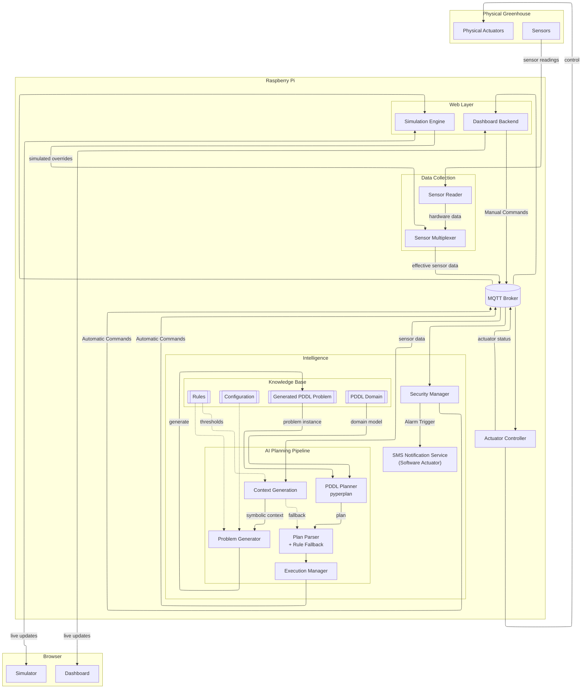
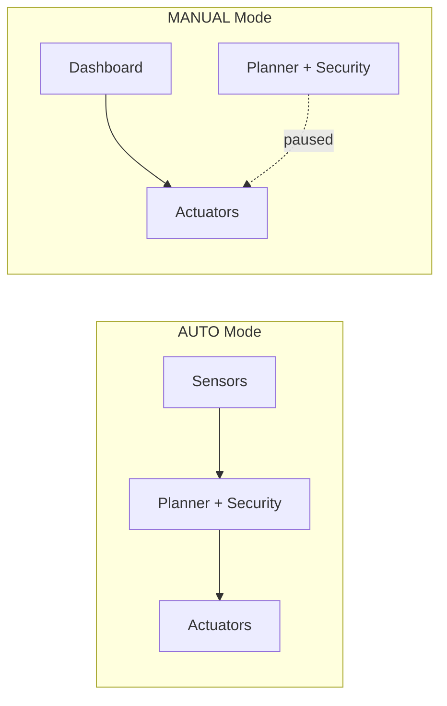

# Smart Greenhouse

MQTT-based smart greenhouse system for Raspberry Pi with Grove sensors, relay actuators, an AI planner (PDDL), security alarms, and a React dashboard.

For deployment and development setup, see [DEPLOY.md](DEPLOY.md).

## Architecture

The system is built around a **message bus** (MQTT). Components publish and subscribe to shared channels — they never talk to each other directly. Data flows in one direction (sensors → decisions → actuators) while the dashboard and simulator sit alongside, reading live state and sending commands when needed.



### How it works

**1. Data collection**

Sensors on the Grove Pi+ hat are read every few seconds by the **Sensor Reader**. Raw hardware readings and optional simulator overrides feed into the **Sensor Multiplexer**, which picks the effective value per field and publishes a single merged stream for the planner, security system, and dashboard. When no overrides are active, the multiplexer passes hardware readings through unchanged.

**2. Intelligence**

Two services consume sensor data and decide what should happen:

| Component | Role | Active when |
|-----------|------|-------------|
| **AI Planner** | Runs a PDDL planning pipeline over the merged sensor stream and outputs actuator commands | AUTO mode |
| **Security Alarms** | Detects intrusion and critical temperature, triggers LED and buzzer | AUTO mode |

Thresholds for both are configurable live from the dashboard Rules Setup.

**The PDDL layer** — the AI Planner is not a single black box; it is a four-stage pipeline backed by a knowledge base:

| Stage | Component | What it does |
|-------|-----------|--------------|
| 1. Context | **Context Model** | Discretises raw readings into symbolic context using threshold rules (e.g. `temperature=HOT`, `soil=DRY`, `light=LOW`). |
| 2. Problem | **Problem Generator** | Turns the current context into a PDDL **problem instance** (`init` facts + `goal`) and writes `pddl/problem.pddl`. |
| 3. Plan | **PDDL Planner** | Runs [`pyperplan`](https://github.com/aibasel/pyperplan) over the static `pddl/domain.pddl` and the generated problem to produce a plan (a sequence of actions such as `turn-on-fan`, `turn-on-pump`). |
| 4. Execute | **Plan Parser** | Maps plan actions to relay/LED commands. If the planner returns no relay actions, it falls back to direct rule evaluation of the context so control never stalls. |

The **Knowledge Base** holds the planner's world model: the static **PDDL domain** ([`pddl/domain.pddl`](pddl/domain.pddl)) defining predicates, actions, preconditions and effects; the **generated PDDL problem** ([`pddl/problem.pddl`](pddl/problem.pddl)) regenerated on every state change; and the **rules config** ([`config/rules.json`](config/rules.json)) supplying thresholds and the day/night schedule.

**3. Actuation**

The **Actuator Controller** receives commands from the planner, security system, or dashboard, drives relays/LED/buzzer on the Grove Pi, and reports current state back to the bus. Manual dashboard commands are tracked so the UI only confirms success when hardware actually responds.

**4. Dashboard and simulator**

The **Dashboard Server** bridges MQTT and the browser — pushing live sensor readings, actuator states, planner context, and events over WebSocket. Users can switch AUTO/MANUAL mode, control actuators manually, and edit rules and port mappings.

The optional **Simulator** attaches to the same bus, letting you override individual sensor values for testing without stopping real hardware. See [Sensor simulator](#sensor-simulator) below.

### Operating modes



In **AUTO** mode, the planner and security system control actuators based on sensor readings and rules. In **MANUAL** mode, only the dashboard sends commands — automation is paused so you have direct control.

## Hardware

This project targets a **Raspberry Pi** with a **Grove Pi+** hat and standard Grove modules. Port numbers below are **Grove Pi connector ports** as used by the `grovepi` Python library (the number printed on the Grove Pi board next to each socket).

### Sensors

Connect each Grove module to the port listed below. Default mappings are stored in [`config/ports.json`](config/ports.json) and loaded by the sensor node.

| Grove Pi port | Grove module | MQTT / dashboard field | Notes |
|---------------|--------------|------------------------|-------|
| **A0** (port `0`) | Grove Sound Sensor | `sound` | Analog read |
| **A1** (port `1`) | Grove Light Sensor | `light` | Analog read; lower = brighter |
| **A2** (port `2`) | Grove Moisture Sensor | `moisture` | Analog read; soil moisture |
| **D7** (port `7`) | Grove Temperature & Humidity Sensor (DHT) | `temperature`, `humidity` | Blue DHT module (DHT11/DHT22) |
| **D8** (port `8`) | Grove PIR Motion Sensor | `motion` | Digital input; `true` = motion detected |

**Quick wiring checklist**

```
A0  →  Sound Sensor
A1  →  Light Sensor
A2  →  Moisture Sensor
D7  →  Temp & Humidity (DHT)
D8  →  PIR Motion Sensor
```

Sensor data is published every 2 seconds on MQTT topic `greenhouse/sensors` (merged from hardware via `sensor_mux/sensor_mux.py`). Raw Grove Pi readings are published to `greenhouse/sensors/hardware`.

### Actuators

Connect relays, LED, and buzzer to the ports below. Default mappings are stored in [`config/ports.json`](config/ports.json) and loaded by the actuator node.

| Grove Pi port | Code name | Dashboard label | Used for |
|---------------|-----------|-----------------|----------|
| **D2** (port `2`) | `buzzer` | Buzzer | Security alarm sound |
| **D4** (port `4`) | `relay1` | Fan | Ventilation (planner turns on when hot or humid) |
| **D3** (port `3`) | `led` | LED | Security alarm indicator light |
| **D5** (port `5`) | `relay2` | Pump | Water pump (planner turns on when soil is dry) |
| **D6** (port `6`) | `relay3` | Grow Light | Grow light relay (planner turns on when light is low during daytime) |

**Quick wiring checklist**

```
D2  →  Buzzer
D4  →  Relay 1  →  Fan
D3  →  LED       →  Alarm / status light
D5  →  Relay 2  →  Water pump
D6  →  Relay 3  →  Grow light
```

Actuator commands arrive on MQTT topic `greenhouse/actions`. The actuator node reports state back on `greenhouse/actuator_status`.

> **Note:** The planner maps the PDDL action `turn-on-led` to **relay3 (Grow Light)**, not the standalone LED on D3. The LED on D3 and buzzer on D2 are mainly driven by the **security node** during intrusion or over-temperature alarms.

## Planner behavior (what triggers what)

| Condition | Actuator action |
|-----------|-----------------|
| Light too low (during day) | Grow Light ON (`relay3`) |
| Temperature too high | Fan ON (`relay1`) |
| Humidity too high | Fan ON (`relay1`) |
| Soil too dry | Pump ON (`relay2`) |
| Motion at night + low light | LED + Buzzer ON (security) |
| Critical temperature | LED + Buzzer ON (security) |

Thresholds for these rules can be changed live from the dashboard **Rules Setup** modal (control icon in the header). Values are stored in [`config/rules.json`](config/rules.json).

## Project layout

| Path | Role |
|------|------|
| `sensor_mux/sensor_mux.py` | Merges hardware readings with simulator overrides |
| `simulator_server.js` | Simulator UI server (port 5001) |
| `sensor_node/publisher.py` | Reads Grove sensors, publishes MQTT |
| `actuator_node/actuator_subscriber.py` | Controls relays/LED/buzzer |
| `planner/` | AI planner — context rules + PDDL |
| `security_node/security_node.py` | Intrusion and over-temp alarms |
| `server.js` | MQTT ↔ Socket.IO bridge + dashboard server |
| `frontend/` | React dashboard (build output in `frontend/build`) |
| `config/rules.json` | Editable planner/security thresholds |
| `config/ports.json` | Editable sensor/actuator Grove port mappings |

## Running

```bash
# Full stack on Pi
./smart_greenhouse.sh

# Sensor simulator (attach mode — requires greenhouse stack running)
./simulator.sh

# Local development
npm run dev
```

Dashboard: **http://\<pi-ip\>:5000**  
Simulator UI: **http://\<pi-ip\>:5001**

## Sensor simulator

The simulator runs alongside the live greenhouse stack and lets you override individual sensor fields without stopping real hardware.

1. Start the greenhouse: `./smart_greenhouse.sh`
2. Start the simulator: `./simulator.sh`
3. Open the simulator UI at port **5001**

How it works:

- Real sensors keep publishing to `greenhouse/sensors/hardware`
- The simulator UI publishes overrides to `greenhouse/sensors/override`
- `sensor_mux.py` merges both into `greenhouse/sensors` for the planner, security node, and main dashboard

Use per-field override toggles to replace readings, or **Send once** for a temporary 2-second override. **Clear All Overrides** restores passthrough from hardware.

Build both UIs before deploying:

```bash
npm run build:all
```

## Changing ports

You can change mappings in two ways:

1. **Dashboard (recommended):** click **Port mapping** (network icon in header), edit ports, then **Save & Apply**.
   - This updates [`config/ports.json`](config/ports.json) and publishes live updates over MQTT.
   - Sensor and actuator nodes apply the new mappings immediately.
2. **Manual file edit:** update [`config/ports.json`](config/ports.json) directly.

Live updates use MQTT topic `greenhouse/ports_config`.
